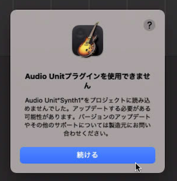
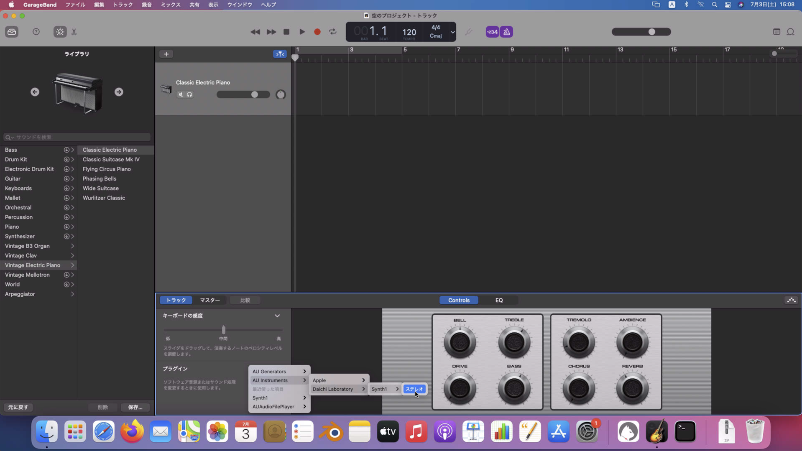
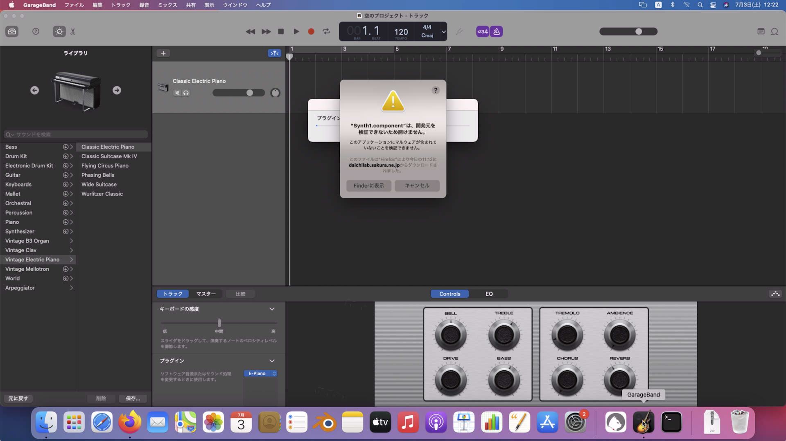
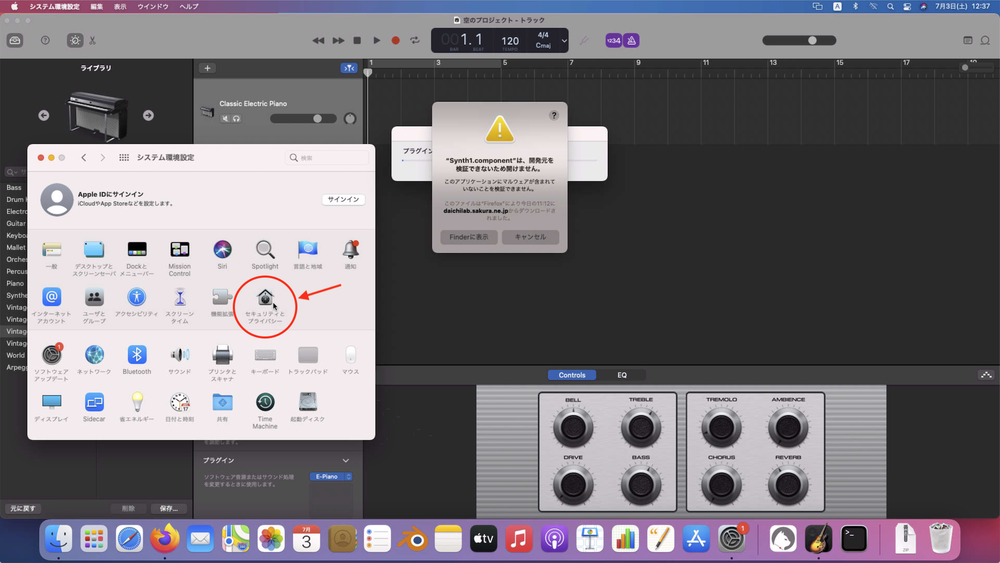

## Synth1 macOS 版でセキュリティーのエラーがでた場合

こんなエラーが出た場合の対処方法

---

1. GarageBandのプラグインでSynth1を開く

    

1. 例のエラーが出ます

    

1. システム環境設定を開いて、「セキュリティとプライバシー」を開く

    
    ↓
    

1. エラーダイアログの「Finderで表示」ボタンをクリックします。

    

    システム環境設定の「ダウンロードしたアプリケーションの実行許可：」の箇所に
    「"Synth1.component"は開発元を確認できないため、使用がブロックされました。」と表示されます。

1. システム環境設定の「このまま許可」ボタンをクリックします。

    

    エラーダイアログは「キャンセル」ボタンを押して、閉じます。

1. GarageBandには「Audio Unitプラグインを使用できません」と表示されます。

    

1. もう一度、GarageBandのプラグインでSynth1を開く

    

1. エラーダイアログに「開く」ボタンが表示されます。

    

1. 「開く」ボタンを押すと Synth1 が使用できます。

    

    ※ 表示モードが「Control」になっている場合は「Synth1 Cocoa View」を選択すると変更できます。

    

---